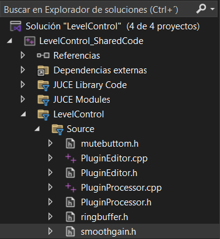

Threads (Hilos) ---> Hay un proceso que estará corriendo separado del resto de los procesos. Procesamientos en paralelo

thread real time (audio processor de mi plugin) ---> Este es el hilo que corre el plugin y debe estar optimizado al máximo para procesar en tiempo real (Audio processor .h y .cpp)
thread UI (audio Editor de mi plugin) ---> Hilo de la interfaz de usuario, separado del anterior (Audio editor .h y .cpp)
Otros threads ---> Acá podemos derivar otros hilos para utilizar en los anteriores. Se pueden destinar tareas pesadas para alivianar la carga del resto de hilos.

# Cómo abrir el proyecto JUCER en C++

